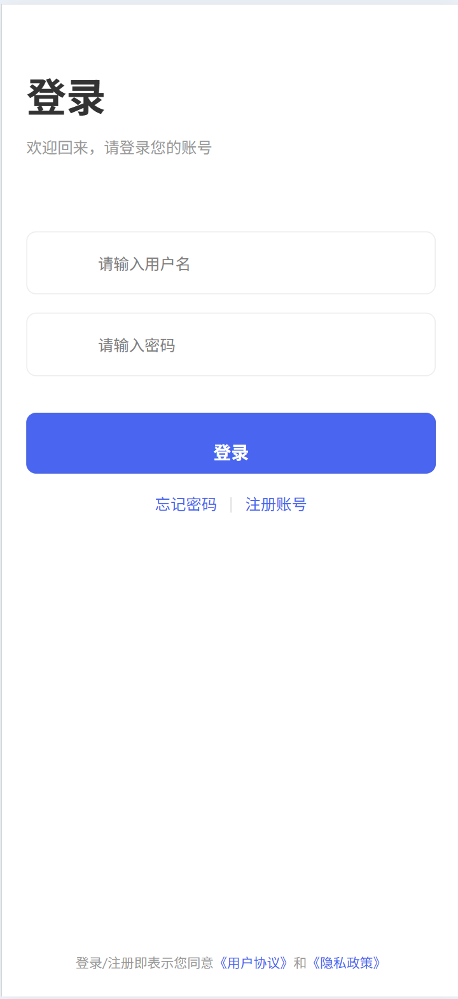
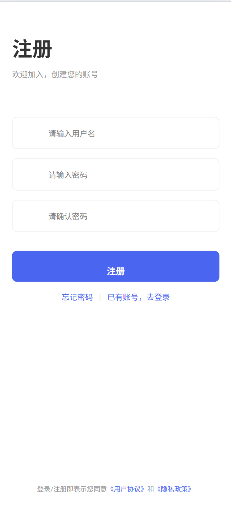

# CSR Web 功能需求说明书（FSD）

## 1. 项目概述
本系统为企业社会责任（CSR）活动管理平台，支持用户注册、活动参与、贡献统计、反馈收集等功能，适用于企业员工及管理员。

---

## 2. 主要功能与用户动作

### 2.1 首页（活动总览）
- 展示全部活动列表，支持点击查看活动详情。
- 显示活动封面、标题、口号、参与人数等。
- 用户可通过"查看更多"跳转至外部活动平台。
- 用户动作：
  - 浏览活动
  - 点击活动卡片进入详情页

> 截图示例：
> 

---

### 2.2 用户登录/注册
- 支持用户通过用户名和密码登录。
- 支持新用户注册账号。
- 登录/注册后自动跳转首页。
- 用户动作：
  - 输入用户名、密码登录
  - 切换注册/登录模式
  - 忘记密码（预留）

> 截图示例：
> 
> 

---

### 2.3 活动详情与参与
- 展示活动详细信息、阶段进度、参与记录。
- 用户可报名参与活动阶段。
- 支持活动阶段图片预览、编辑、删除（部分需权限）。
- 用户动作：
  - 查看活动详情
  - 报名参与阶段
  - 预览活动图片
  - 编辑/删除自己添加的阶段

> 截图示例：
> 

---

### 2.4 自动参与活动
- 支持扫码或链接自动参与活动。
- 显示参与状态、活动标题。
- 用户动作：
  - 自动参与活动
  - 查看参与结果

> 截图示例：
> 

---

### 2.5 个人中心
- 展示用户头像、昵称、ID。
- 支持查看贡献统计、活动记录。
- 提供设置（退出登录、语言切换、修改密码）。
- 用户动作：
  - 查看个人信息
  - 查看贡献统计
  - 查看活动记录
  - 退出登录
  - 切换语言
  - 修改密码

> 截图示例：
> 

---

### 2.6 贡献统计
- 展示用户累计活动数、总时长、已完成/进行中/待参与活动数。
- 展示详细活动参与记录。
- 用户动作：
  - 查看贡献统计弹窗
  - 查看每条活动记录详情

> 截图示例：
> 

---

### 2.7 意见与反馈
- 用户可提交反馈内容。
- 支持反馈弹窗交互。
- 用户动作：
  - 打开反馈弹窗
  - 输入并提交反馈

> 截图示例：
> 

---

### 2.8 动画与交互体验
- 页面切换、按钮、卡片等均有动画效果。
- 用户动作：
  - 体验流畅的动画反馈

---

## 3. 角色权限
- 普通用户：可注册、登录、参与活动、查看贡献、提交反馈。
- 管理员（如有）：可管理活动、用户、审核等（详见后台需求）。

---

## 4. 其他说明
- 多语言支持：简体中文、繁体中文、英文。
- 移动端优先设计，适配主流浏览器。
- 所有截图请放置于 `src/static/screenshots/` 目录下，命名与文档一致。

---

> 文档版本：v1.0  
> 维护者：CSR前端团队 